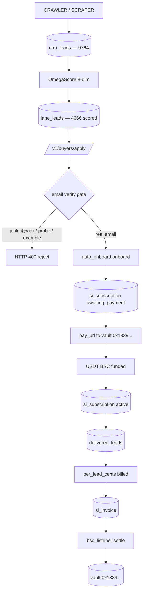
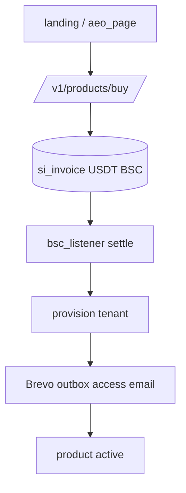
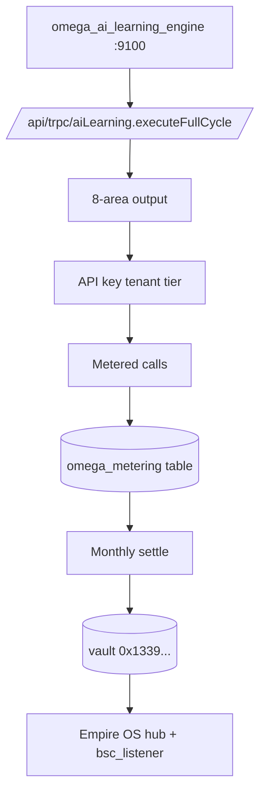
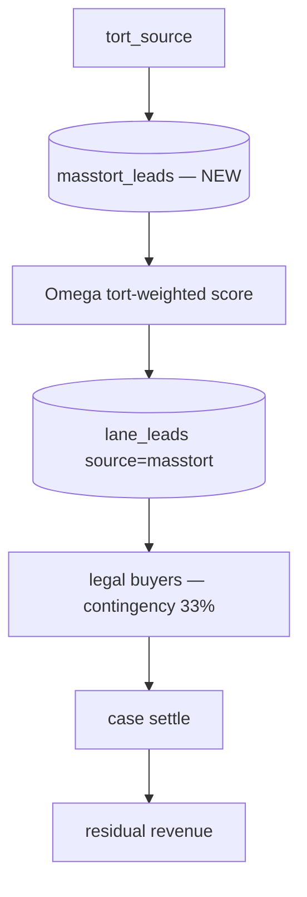
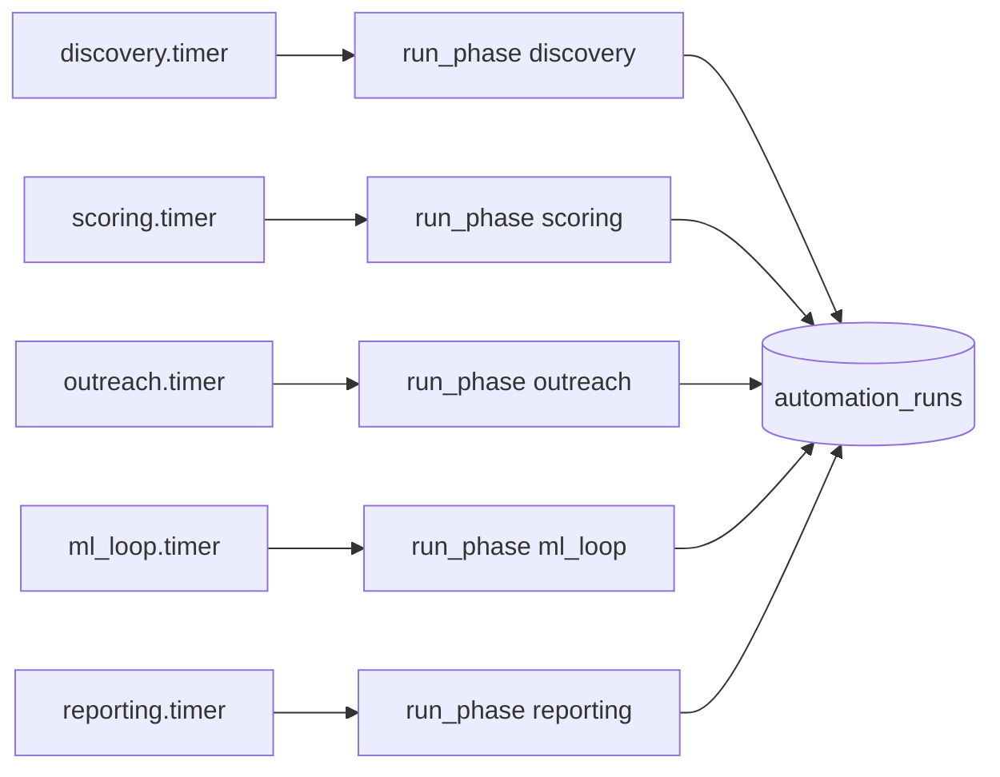

# EMPIRE OS — Workflow Diagrams (Mermaid, copy-paste ready)

Valid Mermaid. Arrows are edges (`-->`), labels on edges (`-->|label|`). No `->` inside boxes.

---

## DIAGRAM 1: Lead Marketplace Loop (Line A — core)

FIXED: email gate hardened (hub.py line 2050). Vault in hub .env.
TODO: per_lead_cents default on active subs (billing fires on delivery).

---

## DIAGRAM 2: SMB SaaS SKU Loop (Line B — 18 products)

TODO: buy to settle to deliver email loop not wired (0 sales).

---

## DIAGRAM 3: Omega AI Engine Loop (Line C — separate business)

LIVE: service active :9100, real OmegaScore 8-dim, metered calls tracked, settles to vault.
NOT lane client — separate business, shares infra only.

---

## DIAGRAM 4: Mass Tort / Legal Loop (Line D — build)

BUILT: masstort_leads table created this session.
TODO: tort source ingestion + legal buyer onboarding.

---

## DIAGRAM 5: 5-Phase Automation (live, recording)

LIVE: 5 timers enabled, record_run writes success/failure to automation_runs.

---

## SCHEMA (key tables)
```sql
-- Line A
si_subscription(subscription_id, tenant_id, plan, seats, price_cents,
  status, per_lead_cents, webhook_url, payment_ref)
si_tenant(tenant_id, email, ...)
delivered_leads(id, lead_ref, buyer_id, lane_id, credit_cost, status, delivered_at)
si_invoice(id, amount_cents, status, ...)
si_settlements(id, amount_cents, settled_by, ...)

-- Line B
si_products(sku, name, tier1_usdc, tier2_usdc, tier3_usdc, tier4_usdc,
  setup_fee_usdc, active, ...)

-- Line C (NEW)
omega_metering(id, tenant_id, area, calls, recorded_at)

-- Line D (NEW)
masstort_leads(id, case_type, claimant_name, email, phone, state,
  status DEFAULT 'pending', omega_score, created_at, source)

-- Automation
automation_runs(id, phase, status, started_at, completed_at,
  duration_seconds, result_json, error_message)
```

---

## SERVICE STATUS (verified 2026-08-29)
| Service | Status | Port |
|---|---|---|
| empire-hub-8081 | activating | 8081 |
| empire-omega-learning | active | 9100 |
| empire-omega-os | activating | — |
| empire-bsc-listener | active | — |
| empire-supervisor | active | — |
| empire-omega-automation@ (5 timers) | enabled | — |
| empire-omega-ai | disabled (dup) | — |

Omega endpoints confirmed:
- GET /v1/health → ok
- POST /v1/omega/score → real 8-dim (tier bronze, 24.1)
- POST /api/trpc/aiLearning.executeFullCycle → metered, settles to vault

FIXES THIS SESSION:
1. Email verify gate hardened (hub.py)
2. Omega engine import fixed (OmegaScore not OmegaScoreEngine)
3. Omega metered-call settlement to vault wired
4. masstort_leads table created
5. Dup empire-omega-ai disabled (port clash)
6. Stale 9100 process killed, omega restarted
7. 5-phase automation recording verified
