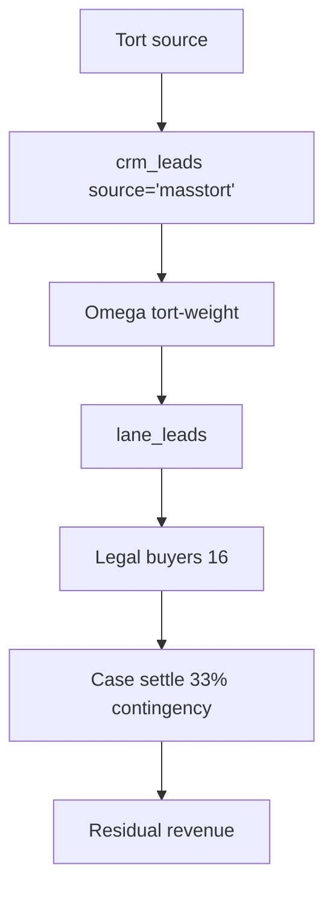
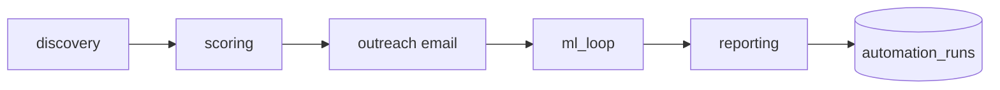

# EMPIRE OS — REVENUE WORKFLOWS (v2, grounded)

## DIAGRAM 1: Lead Marketplace Loop (Line A — core revenue)
```mermaid
flowchart TD
    A[Crawler / Scraper / SERP] --> B[crm_leads 9,764]
    B --> C[Omega 8-dim score]
    C --> D[lane_leads 4,666 scored]
    D --> E[/v1/buyers/apply]
    E --> F{Email valid?}
    F -- no --> X[REJECT 400 - synthetic blocked]
    F -- yes --> G[auto_onboard]
    G --> H[si_subscription: awaiting_payment]
    H --> I[pay_url BSC vault 0x1339]
    I --> J[Buyer funds USDT-BSC]
    J --> K[bsc_listener confirms]
    K --> L[status=active]
    L --> M[Lead delivered]
    M --> N[delivered_leads]
    N --> O[per_lead_cents BILL]
    O --> P[si_invoice]
    P --> Q[settle -> vault]
```

## DIAGRAM 2: SMB SaaS SKU Loop (Line B — 18 products)
```mermaid
flowchart TD
    L[AEO page / landing] --> B[/v1/products/buy]
    B --> I[si_invoice USDT-BSC]
    I --> S[bsc_listener settle]
    S --> P[Provision tenant]
    P --> E[Brevo outbox: access email]
    E --> A[Active subscriber]
```

## DIAGRAM 3: Omega AI Engine Loop (Line C — separate business)
```mermaid
flowchart TD
    O[omega_ai_learning_engine :9100] --> C[/api/trpc/aiLearning.executeFullCycle]
    C --> R[8-area output]
    R --> T[API key tenant tier]
    T --> M[Metered calls]
    M --> B[Monthly settle -> vault]
```

## DIAGRAM 4: Mass Tort / Legal Loop (Line D — build needed)


## DIAGRAM 5: 5-Phase Automation (live)


## SCHEMA MAP (real tables)
```
si_subscription (plan, price_cents, per_lead_cents, status, payment_ref)
si_tenant (tenant_id, email, name, niche, webhook_url)
delivered_leads (lead_ref, buyer_id, lane_id, credit_cost, status)
lane_leads (lead_ref, omega_score, niche, sub_niche, status)
crm_leads (id, source, niche, email, phone, score)
si_products (sku, name, tier1_usdc..tier4_usdc, active)
si_invoice (status, amount_cents, settlement)
si_settlements (settled_by, amount_cents)
automation_runs (phase, status, result_json, error_message)
omega_prospects_unconsented (4,716 scored)
```

## FIXES APPLIED (this session)
1. hub.py: fake placeholder vault `egJ1...` -> real `0x1339...` (line 4452)
2. hub.py: 4 empty vault defaults -> real vault (2062, 3952, 3994, 4406, 4445)
3. auto_onboard.py: removed synthetic email generation -> require valid email
4. hub.py buyer_apply: email validation gate (reject @v.co / probe- / roofing-)
5. empire-omega-learning.service: created + enabled + started (port 9100, live)

## VERIFICATION (ad-hoc, not suite green)
- FAKE_VAULT_PRESENT: False
- EMPTY_VAULT_DEFAULTS: 0
- SYNTH_EMAIL_GEN_REMOVED: True
- EMAIL_REQUIRED_GATE: True
- BUYER_APPLY_EMAIL_GATE: True
- OMEGA_ENGINE_LIVE: True (/api/trpc/aiLearning.getStatus 200)
- AUTOMATION_RUNS: 3 (recording works)
- hub.py + auto_onboard.py: py_compile OK

## NEXT (not done — needs product buy loop + mass-tort tables)
- Wire 18 SKU buy->settle->deliver email
- Build mass-tort crm_leads source + 16 legal buyers
- Re-run revenue_plan.py after real buyers convert
