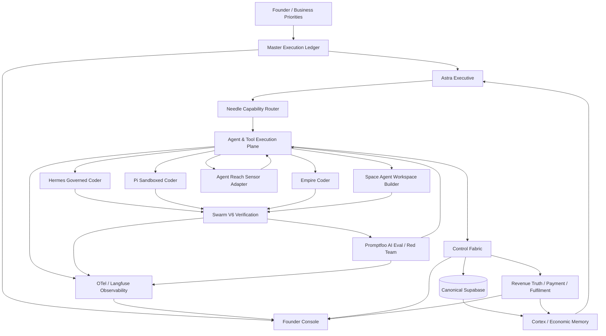
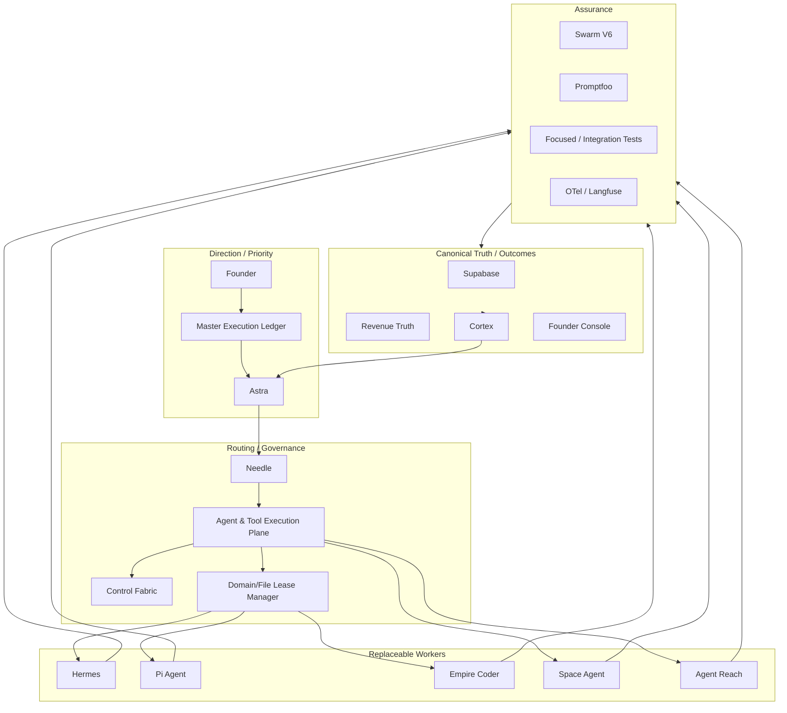
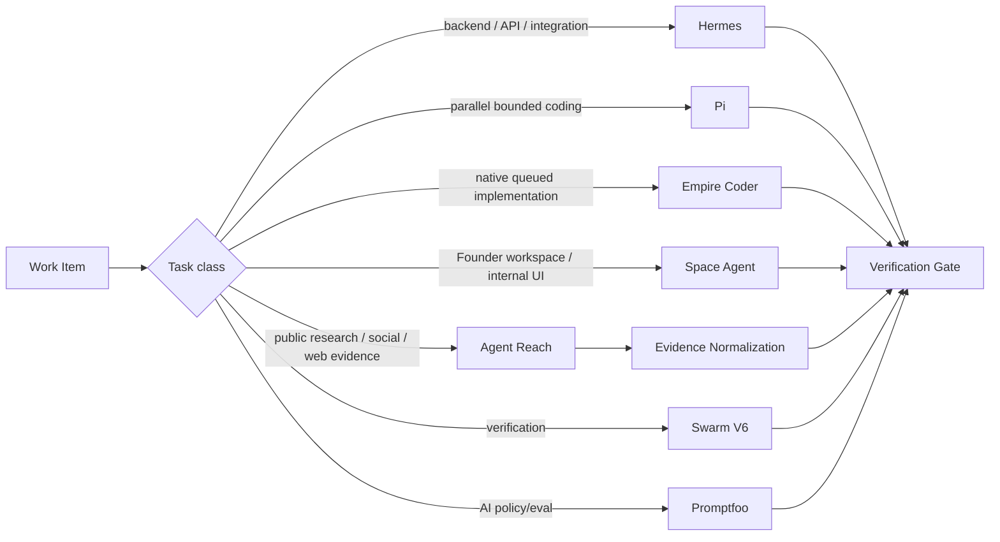
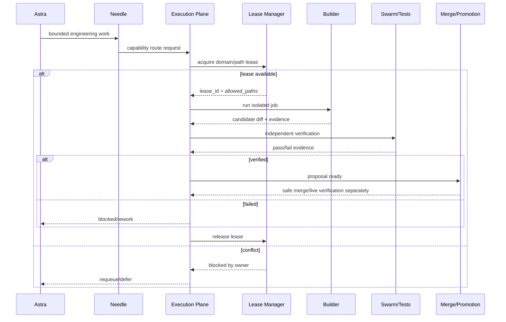
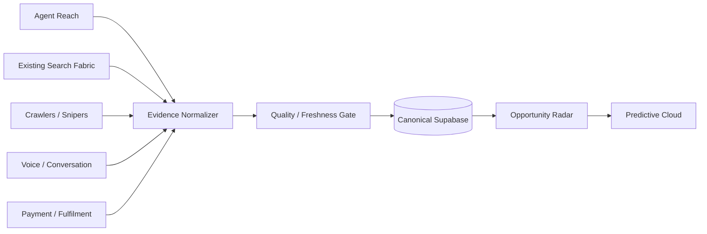
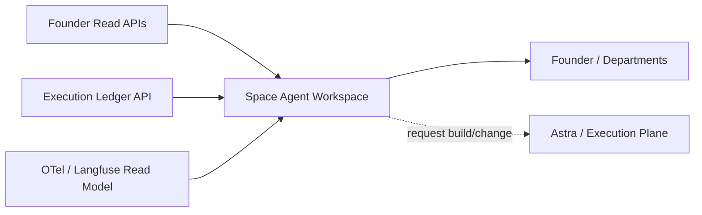
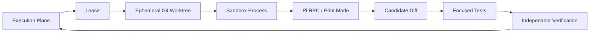
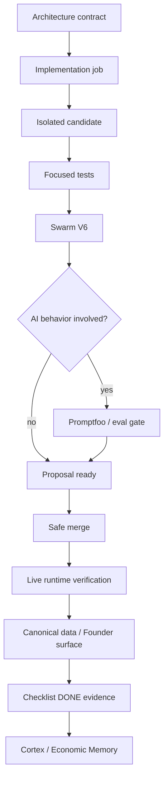

# EmpireOS Agent & Tool Execution Plane Architecture

Date: 2026-09-25
Status: CANONICAL
Doctrine: architecture first → implementation second → verification before promotion.

## 1. Purpose

The Agent & Tool Execution Plane is the governed worker layer beneath Astra and
above individual coding, research, workspace, verification and model tools.

It exists to:
- parallelize the 271+ pending Empire checklist items safely;
- prevent multiple autonomous builders from editing the same domain concurrently;
- keep external agents replaceable;
- preserve Empire authority/truth boundaries;
- make every worker observable, testable and reversible;
- route work by capability instead of product/vendor name.

It does NOT replace Astra, Control Fabric, Revenue Truth, Supabase, Cortex,
Economic Memory, Promptfoo, Swarm V6 or Empire's commercial gates.

## 2. System context

## 3. Layering

## 4. Worker roles

### Hermes
Role: primary governed backend builder.
Isolation: isolated Git worktree.
Mutation: repository only, explicit safe paths.
Output: tested proposal branch + result evidence.
Best for: backend features, APIs, adapters, refactors, production-quality code.

### Pi Agent
Role: secondary high-throughput coding worker.
Isolation: mandatory sandbox/worktree; no direct production repo ownership.
Mutation: repository workspace only under lease.
Output: candidate diff/patch + tests; Empire verifies independently.
Best for: bounded features, tests, refactors, documentation, parallel modules.
Constraint: Pi's default read/write/edit/bash capability is too broad for
unsandboxed production use; Empire wraps it.

### Empire Coder
Role: native queued plan/implement/verify worker.
Isolation: Empire workspace policy + queue policy.
Mutation: reversible repository implementation only.
Best for: Founder directives, smaller bounded checklist work, local model lanes.

### Space Agent
Role: Founder/department workspace and internal UI builder.
Isolation: separate Space workspace/server. It consumes read-only Empire APIs.
Mutation: Space-owned workspace only by default.
Best for: Founder Mission Control, department views, workflow tools, UI iteration.
Forbidden: canonical commercial data writes, direct deployment authority,
payment/revenue mutation, direct production repo edits without a separate build job.

### Agent Reach
Role: public internet/search sensor capability.
Isolation: read/search only adapter; upstream tools treated as untrusted sensors.
Mutation: none to Empire commercial truth.
Best for: Market Sweeps, competitor audience, Reddit/X/YouTube/GitHub research,
intent observations, media research, source discovery.
Rule: health != truth. Every observation requires source/provenance/freshness.

### Swarm V6
Role: independent deterministic verification across specialist lanes.
Mutation: none to production.
Best for: regression testing and cross-module verification.

### Needle
Role: route tasks to capability/tool.
Authority: none. It cannot promote its own routes into execution authority.

### Laya
Role: evidence-backed specialist decisions only.
Current role: high-confidence negative/unsubscribe shadow lane.
Not a coder.

## 5. Capability routing

Routing is by capability, risk, current lease ownership, runtime health, measured
quality, latency and cost. Vendor/tool identity is secondary.

## 6. Authority matrix

| Capability | Observe | Repo write | Canonical data write | External send | Terms | Funds | Revenue recognition |
|---|---:|---:|---:|---:|---:|---:|---:|
| Hermes | yes | sandbox/worktree | no | no | no | no | no |
| Pi | yes | sandbox/worktree | no | no | no | no | no |
| Empire Coder | yes | bounded | no | no | no | no | no |
| Space Agent | read APIs | own workspace | no | no | no | no | no |
| Agent Reach | public read/search | no | no | no | no | no | no |
| Swarm V6 | yes | no production mutation | no | no | no | no | no |
| Needle | route only | no | no | no | no | no | no |
| Laya | shadow decision | no | no | no | no | no | no |

Any future authority expansion requires a separate architecture change and the
existing Empire founder/governance gate.

## 7. Builder lease model

Lease key examples:
- `domain:conversation_os`
- `domain:search_intelligence`
- `path:empire_os/revenue_pulse.py`
- `surface:founder_console`

Rules:
- one mutating owner per overlapping domain/path lease;
- verification workers do not require mutation leases;
- stale leases expire;
- lease state is local operational state, not commercial truth;
- protected paths are never leasable.

## 8. Job contract

Every execution-plane job carries:
- job_id;
- source checklist/plan reference;
- department;
- capability requested;
- risk class;
- authority requested;
- allowed paths or evidence domains;
- input/evidence refs;
- success condition;
- required tests/evals;
- max runtime;
- traceparent;
- rollback strategy;
- output/proposal location.

No worker may widen this contract itself.

## 9. Truth contract

Worker output classes:
- RESEARCH_OBSERVATION;
- CODE_PROPOSAL;
- TEST_EVIDENCE;
- UI_WORKSPACE_CHANGE;
- ROUTE_RECOMMENDATION;
- MODEL_DECISION;
- OPERATIONAL_HEALTH.

None of these are:
- buyer intent;
- accepted terms;
- verified payment;
- recognized revenue;
- realized gross profit.

Only canonical governed systems may establish those states.

## 10. Sensor ingestion model

Agent Reach is additive to Search Fabric; it does not replace canonical crawlers
or become a source of verified commercial intent.

## 11. Space Agent placement

Space may request governed work through Empire. It does not directly mutate the
canonical backend.

## 12. Pi sandbox design

Sandbox defaults:
- ephemeral worktree;
- no production env files;
- no SSH keys;
- no service control;
- no Docker socket;
- no canonical DB credentials;
- no outbound commercial credentials;
- protected paths excluded;
- network disabled unless the architecture contract explicitly requires a
  dependency fetch/model endpoint;
- CPU/memory/runtime caps;
- candidate branch/diff only.

## 13. Failure model

Fail closed:
- authority ambiguity;
- lease conflict;
- protected-path request;
- missing canonical evidence required for a consequential decision;
- schema mismatch;
- unverified code proposal promotion;
- payment/revenue/commercial truth.

Fail open:
- optional observability exporter failure;
- optional research/sensor provider outage where another source can continue;
- optional secondary coder unavailable.

Degraded mode:
- Hermes unavailable → Pi/Empire Coder may handle eligible non-overlapping work;
- Pi unavailable → Hermes/Empire Coder continue;
- Agent Reach unavailable → Search Fabric/crawlers continue;
- Space unavailable → Founder Console canonical UI remains available;
- Langfuse unavailable → local telemetry remains available.

## 14. Observability

Every job emits:
- queued;
- routed;
- lease_acquired / lease_blocked;
- worker_started;
- worker_completed / failed / timed_out;
- changed_paths;
- verification_started / passed / failed;
- proposal_ready;
- live_verification_result;
- checklist_status_changed.

Metrics:
- throughput by worker;
- verified success rate;
- rework rate;
- p50/p95 latency;
- model/tool cost;
- failure class;
- unsafe/path-policy rejection count;
- checklist items closed;
- commercial impact only when independently observed.

## 15. Promotion flow

A proposal is never marked DONE merely because code exists.

## 16. Deployment topology

Initial topology:
- EmpireOS remains the control plane on the existing server.
- Hermes remains systemd-governed and worktree isolated.
- Pi runs only through an Empire sandbox runner.
- Agent Reach gets a dedicated virtualenv/runtime directory and read-only adapter.
- Space Agent runs as a separate loopback/private service/workspace; Founder
  exposure is through the existing gateway/auth design, not a public raw port.
- Swarm V6 remains independent verification.
- OTel/Langfuse receives sanitized traces.
- Supabase remains canonical truth.

## 17. Implementation sequence

1. execution-plane registry + typed job/worker contracts;
2. path/domain lease manager;
3. Hermes adapter;
4. Empire Coder adapter;
5. Pi sandbox adapter + bootstrap;
6. Agent Reach sensor adapter + bootstrap + health evidence;
7. Space Agent read-only workspace adapter + bootstrap;
8. Swarm/Promptfoo verification hooks;
9. OTel telemetry hooks;
10. Founder execution-plane read API;
11. checklist/Astra integration;
12. live shadow verification;
13. promote only proven lanes.

## 18. DONE definition

This architecture slice is DONE only when:
- architecture is saved canonically;
- registry/contracts/tests exist;
- adapters fail closed;
- at least one worker routing test passes per worker type;
- lease conflicts are tested;
- protected paths are tested;
- Founder read surface exists;
- live server bootstrap/runtime verification is completed for activated workers;
- no worker has gained commercial/payment/revenue authority.
