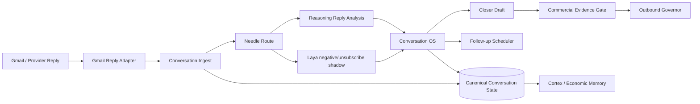
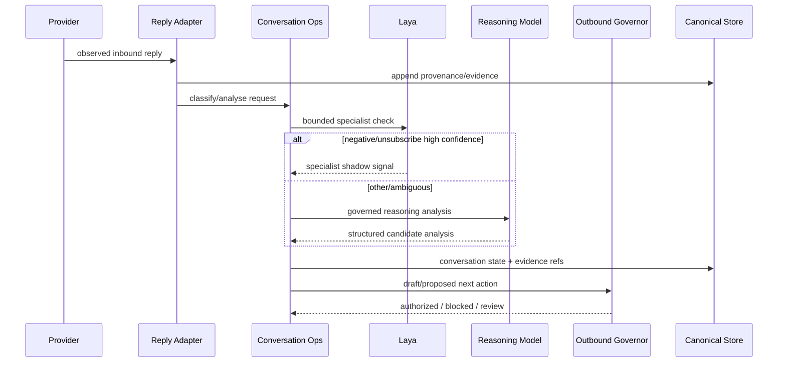
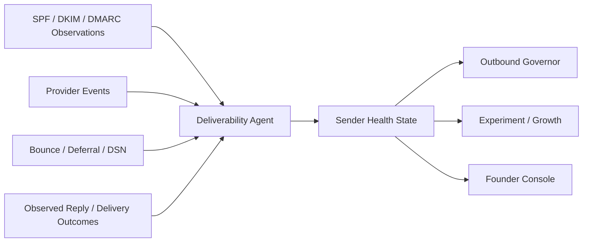
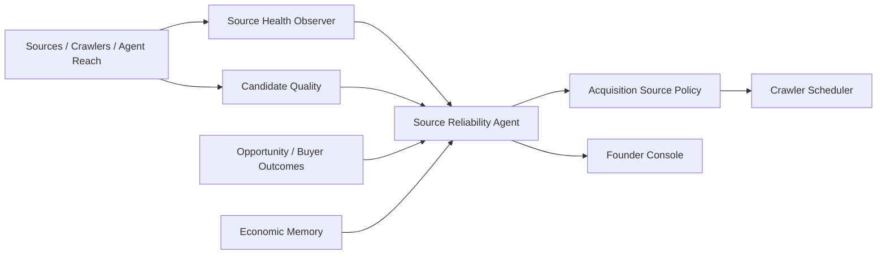
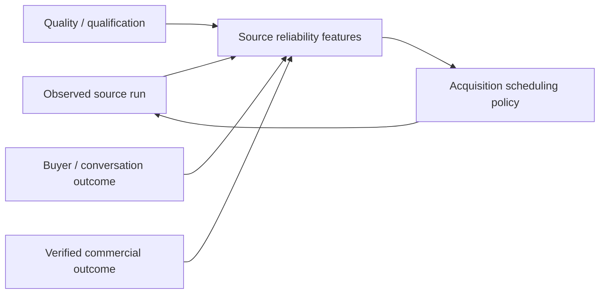
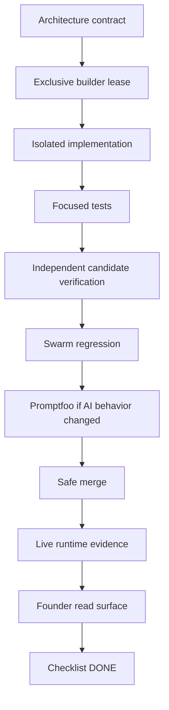

# EmpireOS Business Agent Architecture — Batch 1

Date: 2026-09-25
Status: CANONICAL BUILD CONTRACT
Doctrine: architecture first → implementation second → independent verification → live proof.

This contract covers the first three checklist-clearing business agents:
1. Buyer Reply / Conversation Operations Agent
2. Deliverability & Sender Reputation Agent
3. Data Quality & Source Reliability Agent

These agents extend existing EmpireOS capabilities. They do not create shadow CRMs,
shadow revenue ledgers, shadow buyer stores, or parallel crawler truth systems.

---

## 1. Buyer Reply / Conversation Operations Agent

### Business purpose
Convert real inbound buyer replies into evidence-backed next actions faster while
preserving opt-out, commercial, outbound and revenue truth boundaries.

### Reuse
- `gmail_reply_adapter.py`
- `gmail_reply_runtime.py`
- `conversation_ingest.py`
- `conversation_os.py`
- `conversation_qualification.py`
- `conversation_timeline.py`
- `conversation_value.py`
- `closer_reply_worker.py`
- `closer_reply_draft.py`
- `reply_classifier.py`
- `laya_reply_specialist.py`
- `outbound_governor.py`

### Component flow

### Classification contract
Canonical reply classes:
- positive
- question
- objection
- later
- negative
- unsubscribe
- other/unknown

Laya may contribute only to its evidence-backed specialist lane:
- negative
- unsubscribe
- confidence >= configured specialist threshold
- shadow/no execution authority

All positive/question/objection/commercially material ambiguity escalates to the
stronger reasoning path or deterministic evidence checks.

### Authority
Agent may:
- ingest observed replies;
- update internal conversation analysis/state;
- prepare drafts;
- schedule internal follow-up tasks;
- propose next best action.

Agent may NOT:
- invent buyer intent;
- override unsubscribe/DNC;
- send outside governed outbound authority;
- accept commercial terms;
- move funds;
- recognize revenue.

### Sequence

### DONE
- real provider reply ingested;
- classification/evidence recorded;
- opt-out cannot be bypassed;
- draft/next action generated where eligible;
- no send without outbound authority;
- Founder surface shows reply state and blocker;
- outcome feeds Cortex/Economic Memory.

---

## 2. Deliverability & Sender Reputation Agent

### Business purpose
Protect the revenue channel by observing sender/domain/provider health and
automatically reducing risk without inventing reputation scores.

### Reuse
- `outbound_governor.py`
- `outbound_governor_executor.py`
- `outbound_provider.py`
- `outbound_followup_worker.py`
- `outreach_quality.py`
- provider events in canonical Supabase
- existing Brevo / SendGrid / Gmail provider evidence
- suppression / opt-out / DNC controls

### Component flow

### Evidence model
Observed facts may include:
- SPF/DKIM/DMARC configuration state;
- provider accepted/delivered/deferred/bounced events;
- hard vs temporary failure;
- opt-out/suppression counts;
- send/reply counts by sender/domain/provider;
- current cap/pause state;
- provider/API health.

No fabricated global "sender score" is permitted. Any composite metric must expose
its observed inputs, formula/version and uncertainty.

### Actions
Automatic reversible internal/governor actions:
- recommend or lower bounded sender cap;
- pause an unhealthy sender lane;
- route future eligible sends to another already-approved sender/provider;
- suppress known hard-failure/opt-out destinations;
- open a remediation task.

Founder gate remains required for:
- new paid provider commitment;
- new domain acquisition;
- DNS changes where externally consequential;
- authority/cap expansion outside standing policy.

### Failure policy
Fail closed for:
- opt-out/DNC ambiguity;
- hard-bounce retry;
- missing sender identity;
- invalid provider evidence.

Fail degraded for:
- temporary provider telemetry outage;
- unavailable DNS observation;
- one provider lane down while another approved lane is healthy.

### DONE
- sender/domain/provider state visible;
- temporary vs permanent failures separated;
- suppression evidence preserved;
- unhealthy lanes can be bounded/paused automatically;
- no external send authority is created;
- Founder surface exposes evidence and recommended remediation.

---

## 3. Data Quality & Source Reliability Agent

### Business purpose
Make the sensor mesh optimize for commercially useful evidence rather than raw
row volume.

### Reuse
- `source_health_observer.py`
- `source_intelligence.py`
- `acquisition_source_policy.py`
- `candidate_quality.py`
- `crawler_runner.py`
- `source_qualification_bridge.py`
- `source_buyer_review_bridge.py`
- Search Intelligence health/quality modules
- canonical provenance and source refs

### Component flow

### Metrics
Per source / locale / niche where evidence exists:
- run success/failure;
- latency;
- candidate yield;
- duplicate rate;
- freshness;
- required-field coverage;
- identity-resolution rate;
- qualification pass rate;
- buyer-review readiness;
- downstream conversation rate;
- verified revenue/GP contribution only when genuinely observed;
- cost/resource consumption where known.

### Decision contract
The agent can:
- rank source health/readiness;
- reduce scheduling weight for degraded sources;
- increase bounded sampling for promising observed sources;
- open recovery tasks;
- recommend source retirement/incubation.

It cannot:
- fabricate source economics;
- delete canonical evidence;
- turn a model score into commercial truth;
- permanently retire a source without the documented lifecycle/authority rule.

### Agent Reach integration
Agent Reach observations enter the same provenance/quality gate. A healthy Agent
Reach backend does not prove a source is fresh, accurate or commercially useful.

### Learning loop

### DONE
- source reliability snapshot uses observed fields only;
- source deterioration is detected;
- scheduler can consume bounded recommendations;
- recovery/blocker evidence is surfaced;
- downstream outcomes join back to source provenance;
- Founder Console shows source quality vs commercial usefulness.

---

## 4. Shared architecture rules

All three agents:
- are registered in Control Fabric;
- emit OTel-compatible telemetry;
- use canonical provenance/evidence refs;
- feed verified outcomes to Cortex/Economic Memory;
- get Promptfoo/model eval gates when AI behavior changes;
- get independent code verification before promotion;
- have no fund/revenue-recognition authority.

Builder ownership for Batch 1:
- Buyer Reply / Conversation Operations → Hermes primary
- Deliverability / Sender Reputation → Hermes or Empire Coder after Buyer Reply lease clears
- Data Quality / Source Reliability → Pi primary after Pi runtime activation

Verification:
- Closer/Outreach Swarm lane for Buyer Reply/Deliverability
- Search/Opportunity + Integration QA for Data Quality
- Promptfoo required for classification/reasoning behavior changes

## 5. Promotion gates

