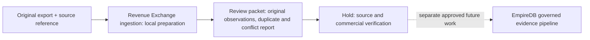

# Lead Smart export evidence preparation

2026-09-28 — bounded architecture delta; Phase 4 OBSERVE / Phase 5 search foundation.

Owner: Revenue Exchange evidence intake, commercial operations. Existing supply
policy, capacity intake, call economics, commercial evidence and terms readiness
remain authoritative for their respective gates. Coverage rows describe exported
service locations, not buyer capacity, allocation eligibility or verified demand.
The existing exchange snapshot requires inventory/capacity counts and verified
per-lead prices; this export supplies none of those. Preparation therefore does
not build or submit a snapshot or commercial-price evidence record.

Interface: `prepare_coverage_export(bytes, source_ref=..., program_ref=...)` in
`empire_os/revenue_exchange_ingest.py`; synchronous, local, deterministic, no I/O.
Output is a JSON-compatible review packet, with byte SHA256, source reference,
program scope, exact original fields and CSV record/line references. Exact rows
deduplicate with occurrence references; differing decimal values remain separate.
Keys scope observations to program, source artifact and original field tuple.
Repeat preparation is idempotent; database idempotency is not claimed.
Classification: OBSERVED export content, unverified expected-value semantics.
Unknown currency, CAC, payout, qualification, caps and inventory remain null.
No tenant writes or new storage; any future writer must bind tenant and dedicated
role through the existing governed EmpireDB path. Migration 018 remains held.

Worker assignment: Codex owns only this delta, the ingestion module extension,
and its focused tests. Verification lane: focused and adjacent tests plus a
separate read-only verifier review after implementation. No concurrent file owner
is displaced. Invalid files fail closed with a record/field error and no partial
packet. Retrying unchanged input is safe; no network dependency or retry loop.
Rollback: remove this additive interface and its tests; no runtime activation.
Reports expose source hash, row counts and conflict groups for local review;
no Founder surface or production deployment is claimed.

Commercial context supplied by the user (not independently verified here):
Lead Smart approved Empire AI for All in One Home Service affiliate participation.
This does not establish purchase of inventory, services or MRR. Dashboard showed
$0.00 revenue, zero sold calls, no tracking numbers. Export analysis reported
43,746 rows, 35,185 exact-distinct rows, 8,600 ZIPs; min 1.00, deduplicated median
5.52, max 13.75; 5,558 service/location combinations with differing values.
No rows may be reconstructed from these figures. Currency, value definition,
payable-call rules, qualification and caps await Seth's response (already emailed).
No paid traffic budget is available; organic traffic is a proposal, not approved
traffic or zero CAC. Affiliate call revenue remains separate from service/MRR.

Authority: OBSERVE only. No database writes, deployment, messages, number requests,
routing, traffic, acceptance, funds, revenue recognition or authority expansion.
`live_traffic_authorized=false` is unconditional.

Verification checklist (results appended after implementation): local tests must
cover leading zeros, exact duplicates, differing values, malformed fields and
numbers, repeat preparation and payable-term separation. Production verification
is deliberately blocked by task scope, actual source availability and a separately
approved governed activation. Local preparation completion is not production DONE.
