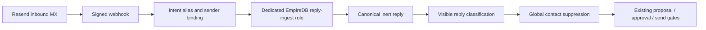

# Inbound suppression repair — architecture delta

Date: 2026-09-29. Scope: corrective maintenance, OBSERVE inspection plus the
founder-requested repair of David Gastley's verified opt-out.

- Owner: existing governed outbound / Resend inbound components; no new store.
- Truth: authenticated Resend evidence, exact intent alias and recipient, and
  EmpireDB records. Email content is inert untrusted input.
- Delta: require dedicated PostgreSQL inbound transport, report missing
  configuration, cast numeric confidence correctly, and exclude quoted outbound
  opt-out footers from classification. Preserve existing role separation.
- Worker: Codex owns the explicitly scoped edits. Focused tests and separate
  read-only live queries provide verification; no delegated mutation.
- Authority: no sends, forwarding tests, DNS changes, migration application,
  service restart, approval expansion, or generic app-role grants. Only the
  explicitly requested real opt-out repair may change production records.
- Failure: missing dedicated DSN fails closed with retryable 503; no generic
  canonical or legacy fallback. Existing signed-webhook boundary remains.
- Tests: exact opt-out, quoted footer, transport configuration, numeric SQL
  parameter, signature/database failure regressions and role boundaries.
- Rollback: revert only this task's scoped hunks. Never remove the verified
  opt-out suppression as a code rollback.
- Promotion: local tests do not establish deployment. Dedicated runtime
  credentials and a founder-approved service restart remain separate gates.
- DONE evidence: recorded in the accompanying outreach inspection report;
  distinguish corrected contact state from unresolved live receiver health.
