# Multi-revenue reconnection — 2026-09-29

```mermaid
flowchart LR
  S[Signal Fabric / crawlers] --> Q[Canonical prospects / identity / qualification]
  Q --> P[Predictive Revenue / Omega]
  P --> R[Opportunity Radar / Factory]
  R --> A[Buyer Acquisition / product demand / ICP]
  C[Commercial catalog / MRR products] --> A
  A --> B[Buyer Scout / first-party evidence]
  B --> H[Reconcile / holding review / governed canonical promotion]
  H --> D[Buyer discovery / people / organisation links]
  D --> X[Commercial Exchange / Revenue Exchange]
  C --> T[Commercial evidence / terms]
  X --> V[Conversation / closer]
  V --> T
  T --> F[Governed payment / fulfilment]
  F --> RT[Revenue Truth / account twin]
  RT --> L[Cortex / Economic Memory]
  L --> P
```

## Trace and gap map

| Existing owner | Working connection | Gap / boundary |
| --- | --- | --- |
| `crawler_runner`, `prospect_ingest` | Real candidates to atomic canonical identity; signal inbox to qualification | Source availability and identity remain gates, never capacity |
| `predictive_revenue_formula`, Omega, `opportunity_radar` | Evidence-backed scoring / Radar / Factory | Missing formula factors remain unknown; no score establishes demand |
| `buyer_acquisition_team` | Catalog, MRR, SMB, reseller, enterprise and ICP research targets | Bounded scout priority can starve entire product/ICP streams |
| `buyer_acquisition_scout`, `buyer_scout` | Search Fabric / first-party probes / provenance | Unknown defaults to qualified buyer; singular buyer type loses non-buyer commercial roles; lightweight scout drops ICP and opportunity linkage |
| `buyer_scout_persistence`, reconciliation / review | Holding area, duplicate checks, atomic governed promotion | Mixed direct/non-direct discovery is blocked wholesale by direct-buyer gate; opportunity references lost in holding provenance |
| `buyer_discovery`, account twin | Person/organisation and verified-contact evidence | Discovery does not verify employment/contact or authorise outreach; incomplete links remain blockers |
| Catalog / identity sync / Exchange | Verified product versions, price/cost/margin evidence, capacity-aware inventory | Many recovered MRR/enterprise identities lack verified economics; Exchange inventory is chiefly lead/call/corridor shaped, not proof all catalog lanes execute |
| Conversation / closer / commercial evidence | Reply observations to governed terms evidence | Reply/discovery never establishes accepted price, geography, cap or terms |
| Fulfilment / Revenue Truth / Cortex / Economic Memory | Orders, verified outcomes and accounting to outcome-conditioned learning | No outcome memory in inspected runtime; no fabricated feedback |
| Lead Smart | Publisher/affiliate call-supply endpoint per founder context | Not a direct lead buyer; payout, payable-call rules, caps and demand require separate evidence |

All existing lanes remain in scope: calls, CPL/exclusive leads, appointments,
MRR, search/GEO/AEO, permits, property, private capital, predictive/opportunity
intelligence, datasets/feeds, APIs, territories/seats, enterprise, white-label,
publisher/affiliate and other evidenced catalog products. No replacement platform.

## Bounded architecture delta before implementation

Owner: Phase 4 Buyer Acquisition, existing deterministic production modules.
Worker assignment: Codex is the sole mutating worker for this delta. Separate
verification pass uses focused, adjacent and negative tests plus runtime reads.

Changes: balance bounded query selection across corridor/product/ICP and pools;
retain multiple research-fit intents with source query references (INFERRED fit,
never observed demand); keep unknown buyer type unknown; preserve opportunities
through reconciliation/holding provenance; allow independently evidenced
non-direct product research through holding review even when also found in a
direct pool. Direct-buyer evidence and every later canonical/commercial gate
remain mandatory for direct-buyer promotion/activation.

No new database/schema/tenant boundary. Existing JSON provenance carries additive
research metadata; EmpireDB remains canonical. Synchronous bounded deterministic
selection, no retries or new scheduler. Existing writer/idempotency contracts
remain. No outbound, terms, payments, allocation, funds, accounting, activation
or role changes. No migration changes; 018 remains HELD. Locked formula untouched.
Missing query/product/site evidence fails closed. Rollback is removal of this
scoped delta, retaining all pre-existing work; never reset the worktree.

Additional traced disconnect: Revenue Distribution drops Radar's existing
product references and does not read the catalog. Reuse explicit product codes
to attach fresh catalog readiness and scout research matches, without inventing
matches from niche strings. Catalog reads receive a retrieval timestamp;
undated/stale catalog artifacts cannot establish current sellability. Price
evidence may be displayed for review, never treated as prospect acceptance.

OBSERVE refreshes may read canonical data and replace existing local snapshots;
they do not prove live commercial execution. Record input age and blockers.
Production DONE remains unclaimed where deployment, canonical or Founder-surface
verification cannot be completed within this task's authority.

## Verification record

2026-09-29T20:39:11Z, branch `agent/data-cloud-wave4` retained. Scoped delta
reviewed against pre-edit copies, including already-dirty Scout and untracked
Revenue Distribution. No staging, commit, reset, stash, branch switch, restart,
schema change, canonical promotion or consequential action was performed.

- 136 focused/adjacent tests passed; no failures. Covers acquisition, both
  scouts, holding persistence/reconciliation/review/promotion, catalog,
  distribution, locked formula, Economic Memory and Exchange inventory.
- `py_compile` passed for all nine changed production modules and the new test
  module; `git diff --check` passed. Final worktree status/stat inspected.
- Migration 018 SHA256 remains
  `e7edcfe1d0f94c3898437e68db0714557370b7b86f9b21ee76cc04be60bc3c21`.
- OBSERVE Radar, acquisition-plan and Revenue Distribution refreshes succeeded.
  36 product targets retained. A 30-query planning inspection included corridor,
  ICP, monthly subscriptions, pilot, API/subscription and enterprise models.
- Refreshed Distribution: 21 observed Radar opportunities; 14 carry explicit
  product references; zero current scout/product research matches. Predictions
  remain evidence-gated. All consequential authority flags false.
- Catalog canonical read attempted but blocked: dedicated materializer
  configuration unavailable in this execution environment. Existing catalog has
  no retrieval timestamp, so Distribution correctly reports `unknown_freshness`.
  Its 26 terms-ready flags are cached evidence, not current sellability proof.
- Bounded live Scout read attempted: three research queries, no domains or
  candidates, DNS failures. No database writes or sends; no failed/empty result
  replaced the existing scout artifact.
- Concurrent runtime scout changed during inspection: initially nine candidates;
  latest inspected snapshot at 20:36:58Z contains one, Mason General Contracting
  Corp (`masonnyc.co`), targeting permit intelligence with no canonical seed ID.
  This is observed first-party research, not confirmed demand or a customer.
- Existing commercial-loop observer identifies `buyer_conversation` as its first
  blocker; terms, verified capacity, allocation, payment, fulfilment, outcome and
  recognized revenue are unobserved. Its freshness is not independently verified.
  Economic Memory snapshot contains zero outcome-conditioned memories.
- Final Distribution blockers: unknown acquisition budget (zero-cash planning)
  and catalog freshness. Earlier crawler unavailability cleared in concurrently
  refreshed producer state; no recovery action was taken by this task.

Cached terms-ready catalog identities: authority_intelligence,
competitor_search_gap, content_protection, geo_ai_visibility, local_search_grid,
managed_service, permit_intelligence, private_capital_rollup,
property_intelligence, search_growth_command, search_opportunity_map,
serp_intelligence_api, technical_search_audit, and solar_opportunity_map for
AU/BE/CA/DE/ES/FR/GB/IE/IT/NL/NZ/PT/US. Recovered Exchange seats and Predictive
Revenue enterprise tiers remain economics-verification gated.

Remaining production gaps: current canonical catalog/prospect reconciliation;
identity/contact links for research prospects; deployment verification of the
changed worker code; verified product-specific demand and agreed terms;
lane-specific delivery readiness (including affiliate payable-call evidence);
independently verified payment/fulfilment/accounting and subsequent Cortex labels.
The generic raw Scout promotion RPC is referenced by its caller but was not found
in `migrations/empiredb`; live availability remains UNKNOWN, not assumed missing.
No DB migration or alternate ingestion platform was added to bypass that gate.

Checklist: diagram, delta, worker assignment, implementation, separate scoped
review, tests, compilation and safe runtime refresh verified. Full production
DONE is **not claimed**: canonical DB access and deployed/Founder-surface
verification remain outstanding. Next highest-value safe action is the existing
governed canonical identity/contact review of the observed permit prospect,
alongside a fresh catalog read through the dedicated production materializer.
