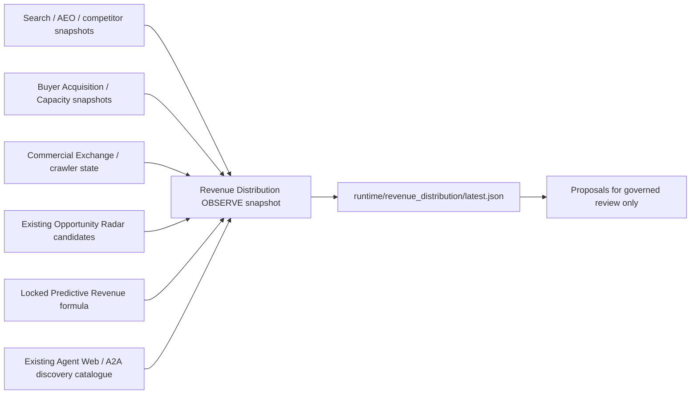

# Revenue Distribution: first slice

Architecture delta: one local deterministic read model, not a scheduler,
database, scoring system, payment adapter or new public endpoint. EmpireDB
remains canonical. Producer snapshots are observations, not fresh database
verification. Ops MCP can inspect the artifact using its existing audited file
reader. WebMCP/A2A discovery contracts remain unchanged. USDT/BSC remains the
payment rail; this slice imports no settlement implementation.

Worker assignment: Codex implements the read model, CLI and focused tests.
Verification is a separate test/review pass; live verification is limited to
reading existing snapshots and writing the requested local artifact. No
activation, migration, staging or commit is authorized.

Inputs use existing runtime paths enumerated in `SOURCES`. Summaries copy only
allowlisted counts; raw contact details and crawler logs are not republished.
Source refs include content digests. Missing, malformed, future-dated or older
than 24 hours sources cannot generate opportunities or action proposals.
Undated sources remain observable but unusable for decisions. The AEO census
currently has no timestamp, so requires producer evidence before decisions.

Opportunity Radar supplies identity and provenance; observed priority scores
are not revenue. Optional `predictive_revenue_inputs` and
`predictive_revenue_evidence_refs` on a candidate use the locked formula's
factor names, including `ltv_cents`. Every factor requires a nonempty reference
list; absent/invalid factors stay unknown. Existing Radar does not yet emit
these fields: no production revenue contribution is assumed. This is an
additive evidence contract, not a second score or an economics estimator.
Known contributions sort descending, with opportunity keys as stable ties.
Unscored opportunities remain evidence-completion proposals.

Acquisition budget is explicit optional input in cents. Unknown budget is
reported as null and conservatively uses zero-cash planning. Zero-cash ordering
prefers existing inventory, owned crawler research, organic search, buyer
research and discovery. Paid traffic is never proposed in this slice, even
with a positive budget. Source flags cannot grant authority. Every action is
proposal-only and requires governed review before execution. Aggregate buyer
readiness does not establish a particular buyer's capacity, price or payout.

Determinism means identical parsed inputs, budget, freshness window and explicit
`generated_at` produce identical output. The CLI supplies the observation time
and atomically replaces only the distribution artifact using a unique temp file.
No upstream refresher is invoked. Revenue Truth/Economic Memory writes and
demand-directed crawler execution are deferred to separately governed slices.

## Verification record — 2026-09-28

Inspected: `AGENTS.md`, `ops_mcp.py`, `agent_web.py`, `agent_web_runtime.py`,
`public_gateway.py`, `a2a_discovery.py`, `aeo_surface.py`,
`predictive_revenue_formula.py`, `opportunity_radar.py`,
`buyer_capacity_readiness.py`, `buyer_allocation.py`,
`commercial_exchange_contract.py`, `buyer_acquisition_team.py`,
`buyer_acquisition_scout.py`, `competitor_search_presence.py`,
`signal_inbox.py`, `search_intelligence/serp.py`, the corresponding runtime
snapshot structures and producer path/caller references. Read the Radar and
capacity builder scripts, Exchange refresher, and existing surface tests.
Dirty producers were inspected only; no existing tracked file was edited.

- Diagram / architecture delta / worker assignment: recorded before implementation.
- Separate verification pass: 127 tests passed (91 existing surface tests plus
  36 distribution/formula tests), one existing Starlette deprecation warning.
- The 36 focused tests also passed directly without a harness.
- Standard TestClient execution stalls because this sandbox rejects
  `socketpair.send` with `PermissionError: EPERM`; an independent socket/AnyIO
  probe reproduced it. Full-suite verification used the temporary
  `/tmp/revenue_distribution_pytest_polling.py` pytest plugin, limiting
  `EpollSelector.select` waits to 10 ms. Application code, routes, assertions
  and test cases were unchanged. This is a test-environment qualification,
  not a claim that the unmodified sandbox TestClient run completed.
- Command: `PYTHONPATH=/tmp:/srv/empire_os timeout 60s .venv/bin/python -m pytest
  -q -p revenue_distribution_pytest_polling tests/test_revenue_distribution.py
  tests/test_predictive_revenue_formula.py tests/test_ops_mcp_auth.py
  tests/test_public_gateway.py tests/test_agent_web_product_catalog.py
  tests/test_a2a*.py tests/test_aeo*.py tests/test_legacy_mcp_retirement.py`.
- `py_compile`: passed for the new module, CLI and tests.
- `git diff --check`: passed; new untracked files also checked explicitly.
- Local artifact verification: 21 opportunities, 26 proposals, all contributions
  unknown and all consequential authorities false. No upstream refresh executed.
- Runtime blockers: search and competitor snapshots stale; AEO census undated;
  acquisition budget unknown (conservative zero-cash planning). All Radar
  opportunities lack evidenced canonical formula inputs.
- Migration 018 hash remains the required value; no migration was touched.
- Nothing activated, staged or committed. Existing dirty changes preserved.
