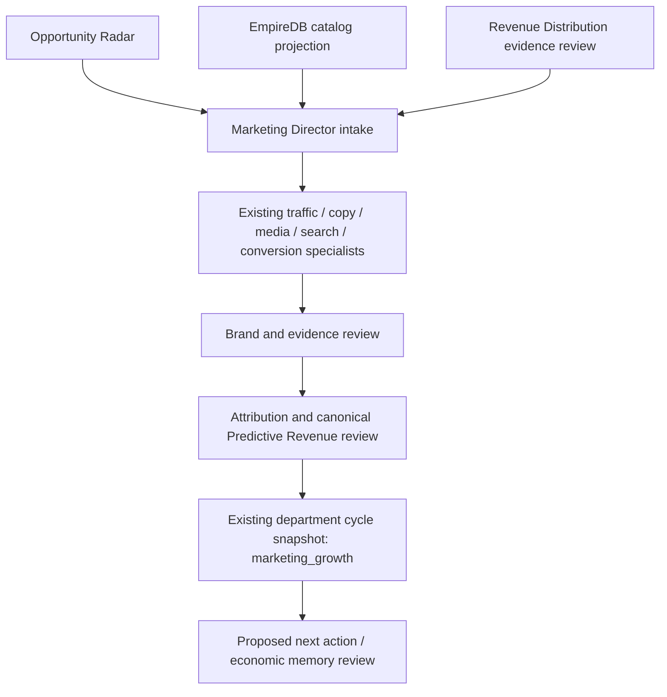
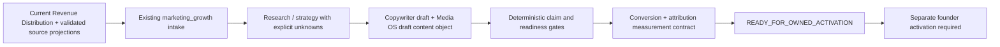

# Marketing & Growth agency V1 architecture delta

Owner: existing `marketing_growth`, Phase 4 OBSERVE / Phase 5 organic planning.

Purpose: coordinate existing capabilities into evidence-bound campaign proposals;
no duplicate department, database, specialist engine, revenue equation or queue.
Canonical business truth remains EmpireDB. Runtime files are read projections,
not business authority. Unknown facts and economics stay null/UNAVAILABLE.

Interface: pure bounded build over existing producer snapshots, up to five jobs.
Freshness and product matching reuse Revenue Distribution. Only unambiguous
explicit product matches and evidenced Radar opportunities qualify. Scoped
customer jobs are excluded until a tenant-authorized intake exists; internal
account label Empire AI grants no tenant identity. Stable job identities derive
from opportunity/product identity, never prospect identity.

Output: `marketing_growth` in `runtime/astra/department_cycle_latest.json`.
Normal department cycle includes this projection. A separate observe-only
record command merges just this field, preserving heartbeat state and refusing
replacement if it changed during the build. No worker queue is run by that command.
Plans are PROPOSAL; inputs are observed producer evidence, not verified outcomes.

Worker assignment: Codex owns this delta, agency module, narrow registry/cycle
integration, command and focused tests. Existing dirty changes remain intact.
Verifier lane: focused negative/contract tests plus required adjacent regressions,
formula hashes and scoped diff review. No model execution requires evals here.

Authority: OBSERVE, execution none. No send, publishing, indexation, spending,
terms, payments, fulfilment, revenue recognition, migrations or service control.
AGI marketing's ACT path is deliberately not callable: it deploys content.
Copywriter and Media OS are invoked through pure review/build functions only.
Paid planner has no budget or execution adapter. Lifecycle requires current
suppression/opt-out/conversation evidence before even recommending a touch.

Execution: synchronous local read/build, max five jobs, no retries or external
calls. Source loss/freshness/schema failure produces blockers or empty intake.
No business writes. Atomic unique-temp snapshot replacement; concurrent change
causes refusal. Service writers remain existing owner. Rollback removes the
new field/call; upstream business stores and existing cycle fields are untouched.
Observability: generated_at, source checksums/freshness, rejected intake reasons,
per-job missing evidence, assignments, authority and prediction availability.
Commercial fit: prioritize existing conversations when explicitly evidenced,
then ready products, owned intelligence and organic research. This ordering is
policy, never a new revenue score. Economic memory receives no invented outcome.

Verification: run focused and adjacent tests, compile, diff check, locked hashes,
and safe local current-evidence intake. Deployment/restart and externally visible
production promotion are outside this authorized slice. Runtime snapshot review
is evidence of local OBSERVE intake only, not deployment completion.

## Verification record — 2026-09-30

- 106 focused/adjacent tests passed, including the department cycle.
- Changed Python modules and command compile; repository diff check passed.
- Both locked formula hashes and held migration 018 match required values.
- Safe OBSERVE command recorded five plans in the existing department snapshot:
  class action lawyer / Atlanta; HVAC / Dallas–Fort Worth; mass tort lawyer /
  Austin; medical malpractice lawyer / Houston; personal injury lawyer / Atlanta.
  All have explicit `managed_service` catalog matches. These are source segments,
  not newly asserted buyers or verified campaign demand.
- 30 zero-cash proposed actions; five unavailable predictions. Missing canonical
  factors are preserved. Conversion and competitor snapshots were stale and
  therefore excluded from current evidence reviews. Copy is an unapproved draft;
  verified media packs, campaign attribution and lifecycle state remain missing.
- No queue execution, restart, external action, staging or commit performed.
- Production service deployment/Founder UI verification remains outside scope.

## Campaign operating engine delta — 2026-09-30

This extends the existing agency owner, not a second campaign engine or scheduler.
Worker assignment: Codex, exclusive edits to agency/copywriter/media draft adapter,
role registry, focused tests and this delta. Verification is a separate test and
artifact-readback pass. No business authority changes. Existing department cycle
remains the scheduling owner and its marketing_growth field remains the artifact.

Intake follows canonical Revenue Distribution ordering, with a current on-disk
projection read for provenance and reconciliation. Revalidated source evidence
controls eligibility. Unmatched products may produce research enquiry campaigns;
product identity remains null, never an inferred catalog match. Account label is
Empire AI; unresolved tenant/account IDs remain null. Customer-scoped records are
rejected until authorized through tenant_isolation.authorize_tenant_resource.

Assets are internal deterministic drafts, built through Copywriter and Media OS
canonical content types. They assert no market performance or product efficacy.
No research pack is marked verified to manufacture content readiness. Drafts,
briefs, source refs, gates and stage history persist inside the existing projection.
Stable identity is opportunity + product (or explicit unknown) + objective. Each
cycle materializes the same deterministic lifecycle, rather than appending jobs.
Evidence changes rebuild gates; lost evidence cannot retain readiness. No ACTIVE
transition exists in this slice. No claims of observed learning without outcomes.

Unknown conversion/traffic/demand/cost remains null. Internal readiness is not
publication approval; activation still requires ownership, endpoint, privacy,
tenant and founder checks. Quality gates cover the deliberately limited draft
claim surface; substantive market claims require the existing verified media flow.
Rollback removes the campaign extension; no migrations, queue jobs, canonical
business writes, publication, indexation, paid traffic or external actions occur.

## Campaign verification record — 2026-09-30

- 130 tests passed: campaign/agency, all ten requested regression modules,
  department cycle, Media OS foundation and media content pipeline.
- Changed production Python modules compiled; `git diff --check` passed.
- Both formula SHA256 values and held migration 018 match required hashes.
- Ran the existing agency-only department recording command, then ran a second
  cycle and read the persisted artifact back. Campaign IDs, asset IDs and stage
  histories were identical; other department snapshot fields were preserved.
- Current canonical top five: Denver roofing coverage; Atlanta class-action;
  NYC general contractor; Dallas–Fort Worth HVAC; Denver HVAC. All five reached
  internal READY_FOR_OWNED_ACTIVATION with 20 drafts, 30 creative briefs, five
  traffic routes, five conversion plans and five attribution contracts.
- All five predictions remain UNAVAILABLE. Three product matches and all tenant
  IDs remain unknown. No campaign performance, market demand or outcomes invented.
- Ready means draft pack readiness only. Owned endpoint deployment, tenant/account
  resolution, privacy review and founder activation remain prerequisites for use.
- No external publication/indexation/outbound, paid spend, business mutation,
  service restart, staging or commit. Service deployment is not claimed.
