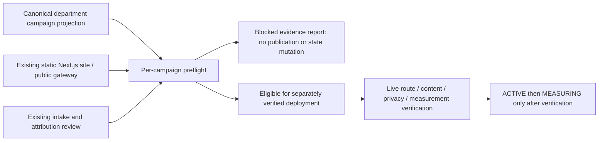

# Owned organic campaign activation V1 — preflight

Owner: Marketing & Growth, existing public site and public gateway.

Founder authority in this task permits the current ready campaigns on owned web
surfaces only, conditional on all gates. It does not authorize paid media,
outbound, social posting, index submission, commercial acceptance, payment or
revenue mutation. Prediction availability is not a gate.

This bounded delta implements a read-only, repeatable preflight over the existing
`marketing_growth.campaigns` projection. It does not create a campaign engine,
collector, database, identity scheme, or a deployment path. EmpireDB remains
canonical business truth. The audit report is operational evidence, not campaign
authority. It preserves internal account label and unresolved IDs as observed;
it never assigns a customer tenant or invents an internal UUID.

Worker assignment: Codex owns only this delta, the new preflight module/command,
its tests and the task audit artifact. Verification is a separate focused test,
artifact readback and build pass. No existing dirty implementation is overwritten.

Failure behavior: evaluate every campaign independently; missing or ambiguous
identity, claim scope, conversion contract, reviewed useful content or verified
infrastructure blocks that campaign. No mutation of the canonical snapshot,
stage history, public output directory or business stores occurs. Repeating the
same input gives the same report. Unknown campaign lookup fails closed. There
is deliberately no activation transition in this preflight utility.

Current inspection: `apps/empire-public-site` exports static HTML; the installed
`empire-public-gateway.service` serves its `out/` through FastAPI on loopback
port 80. Blueprint V6 identifies empire-ai.co.uk through Cloudflare Tunnel.
Gateway owns sitemap and robots. Building in the served source directory could
replace live files, so validation builds must run in an isolated temporary copy.
No new deployment procedure is introduced.

Existing research drafts are claim-free invitations, not reviewed substantive
research pages. All current landing sections repeat the same questions and
limitations. The available checkout/intake contracts require product or tier
selection and business identity; they are not a minimal research-question intake.
Search attribution is an evidence-only recognized-revenue preview, not a browser
event collector. These gaps must not be papered over with mailto submission
events, fabricated business identities, or a new unreviewed data store.

Rollback: remove only this audit utility/report; it changes no runtime routing.
DONE for activation requires actual public verification and all user gates. A
blocked report, successful tests, or a successful build does not establish DONE.

## Verification record — 2026-09-30

- Five current campaigns inspected independently; all remain READY, with zero
  publication/activation. Claim-free scope, CTA split, provenance and proposed
  event fields pass; publication content review and infrastructure gates do not.
- 106 focused agency/site/search/tenant tests passed. One HTTP attribution test
  was deselected after TestClient hangs. A separate existing gateway health test
  timed out after 25 seconds. No live HTTP pass is claimed.
- All five actual paths are absent from local route registration, export and
  sitemap. Repeated audit is identical and the source snapshot is unchanged.
- Isolated production build fails because Turbopack needs a forbidden local
  socket; webpack diagnostic fallback fails parsing TypeScript --showConfig.
  Standalone TypeScript check passes. No lint script exists in this app.
- Python compile and git diff check pass. Formula hashes and held migration 018
  match. Branch and concurrent work preserved; no staging or commit.
- Evidence: `runtime/astra/owned_campaign_activation_v1_report.json`.
- No eligible deployment exists. No restart command is recommended: restarting
  would not repair the failed preflight gates. Activation checklist remains open.
