# Owned campaign runtime foundation / activation preparation V2

Status: implementation proposal; DB and deployment HELD. Phase 5, Marketing & Growth.

```mermaid
flowchart LR
 C[Existing five READY campaigns + hashed Radar/catalog evidence] --> A[Useful research assets]
 A --> R[Exact byte digest + claim/provenance + quality review]
 R --> P[Existing owned_campaign_preflight V2]
 P --> H[Held deployment artifact / no state mutation]
 H --> G[Existing public_gateway, after explicit release verification]
 G --> E[Strict event/enquiry contracts]
 E --> D[EmpireDB dedicated intake role / held migration 025]
 D --> O[Observed first-party evidence only]
```

## Contract and placement

This extends the existing campaign projection, public_gateway and static-site
architecture. No campaign engine, service, queue or business JSON database is added.
Prepared HTML and audit JSON are reproducible build artifacts only. EmpireDB owns
business records. Public owner is Empire AI / empire_owned, account_id and tenant_id
remain null; customer access remains false. Customer tenancy is not resolved.

Inspected write owners: public_gateway, canonical_data_gateway, EmpireDBProvider,
PostgresConnector, data_query, tenant_isolation, conversion_data_repository,
conversion_runtime, commercial_funnel, search_intelligence.attribution,
self_serve_checkout_api, exchange_self_serve, predictive_revenue_self_serve and
EmpireDB migrations. Conversion is a commercial evidence reader; search attribution
is a recognized-revenue preview. Product intake requires product/business identity.
Conversations require a prospect/entity/buyer/closer identity and lack a web channel.
Commercial events and intelligence observations cannot honestly represent anonymous
browser activity or a reply address plus research question. No suitable existing
canonical write contract was found in repository schema evidence. Live schema
inventory has not been verified from this sandbox.

Migration `migrations/empiredb/025_owned_campaign_intake.sql` is
**HELD_FOR_FOUNDER_DB_APPROVAL**. Two append-only tables store campaign observations
and inbound research enquiries. Dedicated NOLOGIN role receives only two bounded
function privileges; generic empiredb_app receives none. The existing private
PostgresConnector is reused with a dedicated DSN, never a generic credential fallback.
No migration, role provisioning, production write or service restart is authorized
by this preparation step. Migration 018 is untouched.

## Execution, privacy and failure

Synchronous bounded JSON requests, strict unknown-field rejection, same-origin checks,
body limits and bounded per-process abuse counters. No raw IP or user-agent persistence;
in-memory keyed client hashes expire. Production proxy identity / aggregate ingress
limits require live verification before release. Event UUID dedupe rejects conflicting
replays. Exact normalized enquiry dedupe is atomic; enquiry and its server-observed
submitted event commit together. Browser events are observations, never identity or
proof of qualification. No marketing consent, outbound, automatic followup, commercial
acceptance, demand verification, payment or revenue authority exists. No secrets in
responses or logs. Missing reviewed release, schema, dedicated role or provenance fails
closed. No retries; caller may safely repeat an identical request.

Published release must bind the current campaign digest, reviewed HTML bytes,
collector script digest, infrastructure PASS evidence, and explicit deployment
verification. Preparation never writes that release file. Unpublished routes return
404 and stay out of sitemap. AUTO_INDEXATION=false. Rollback removes the release and
reverts only this slice; retained enquiry evidence is not deleted implicitly.

## Worker assignment and verification

Codex owns the narrow content/review, preflight, gateway extension, backend repository,
held migration, browser script, preparation command and tests. No parallel mutating
workers. Independent verification is a separate adversarial test/readback pass;
no self-awarded live verification. Focused existing slice, negative contract tests,
compile, standalone TypeScript check, isolated webpack export, hashes and diff review
are required. Live migration/role/proxy/route checks remain outstanding. This improves
visitor research utility and permits future measurement; no economic result is claimed.
